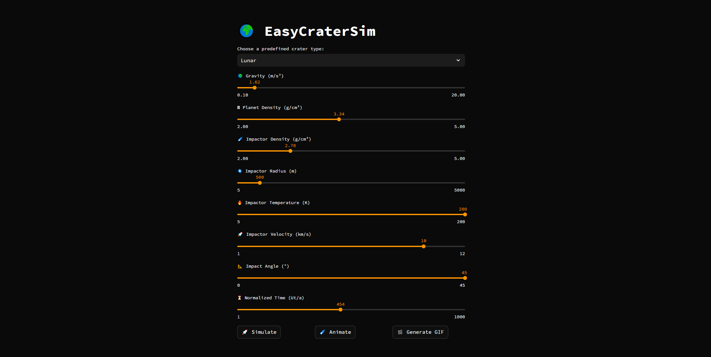

# EasyCraterSim 1.1.0
**EasyCraterSim** is a lightweight numerical simulation tool designed to model the formation and evolution of impact craters based on the equations and methodologies described in the paper:
***O'Keefe, J. D., & Ahrens, T. J. (1999). Complex craters: Relationship of stratigraphy and rings to impact conditions. Journal of Geophysical Research: Planets, 104(E11), 27091-27104.***
This project aims to provide a simple and accessible visualization of crater growth dynamics based on fundamental physical parameters.

[https://easycratersim.streamlit.app/]

# 🛰️ Scientific objectives
- Understand the processes involved in impact crater formation.
- Model the transition between simple and complex craters *(WIP)*
- Study the influence of physical parameters such as gravity, impactor velocity, surface strength, and planetary density.
- Visualize the evolution of a crater profile over time, normalized by impactor diameter.

# 📊 Features
- Choose pre-set crater types (Chicxulub, Meteor Crater, Tycho, Copernicus, and more).
- Customize key physical parameters (gravity, impactor size, velocity, angle, temperature, etc.).
- Visualize the crater shape at a specific time or animate its evolution.
- Graphical output showing normalized radius and depth of the crater.
- Download a GIF showcasing the evolution of the crater
- Choose between **Single Crater Simulation** or **Comparison Mode** *(WIP)*

# 🧠 Work in progress
- **Comparison Mode :** A new mode able to compare two craters, either side by side or by overlaying
- **Multipages :** Handling multipages on Streamlit to make the UI even clearer!
- **Reverse Simulation :** Choose a crater and EasyCraterSim will estimate the impactor's parameters!

## 🖼️ Interface Preview


# 🖥️ How to use

## Enjoy the latest up-to-date version
The interface, using the latest version, is available here : [https://easycratersim.streamlit.app/]

## Self hosting
If you want to host the interface by yourself

### Prerequisites
Ensure you have the following installed: 
- Python 3.x
- Streamlit
- Matplotlib
- Scipy
- Numpy

### Installation
```py
pip install streamlit matplotlib scipy numpy
```

### Running
```
streamlit run app.py
```

## Accessing the interface
The direct link to your *Streamlit* interface should be directly displayed into the terminal where you entered the streamlit prompt.


# ⚙️ Context
This program was developed as part of the course unit 'Mathematical Modeling,' supervised by E. Léger and H. Massol, during my Bachelor's degree in 'Earth and Universe Sciences' at the University of Paris-Saclay.
This project is based on the equations and impact crater formation models described in:
***O'Keefe, J. D., & Ahrens, T. J. (1999). Complex craters: Relationship of stratigraphy and rings to impact conditions. Journal of Geophysical Research: Planets, 104(E11), 27091-27104.***

# 📄 Citation
If you use this project, please cite as follows:
```latex
M. Soares Correia. (2025). EasyCraterSim (v1.1.0). Zenodo 10.5281/zenodo.14895828
```

# 📧 Contact 
For questions or contributions: [maxime.soares-correia@universite-paris-saclay.fr]

# 📝 License
This project is licensed under the GNU GPL v3 License.
